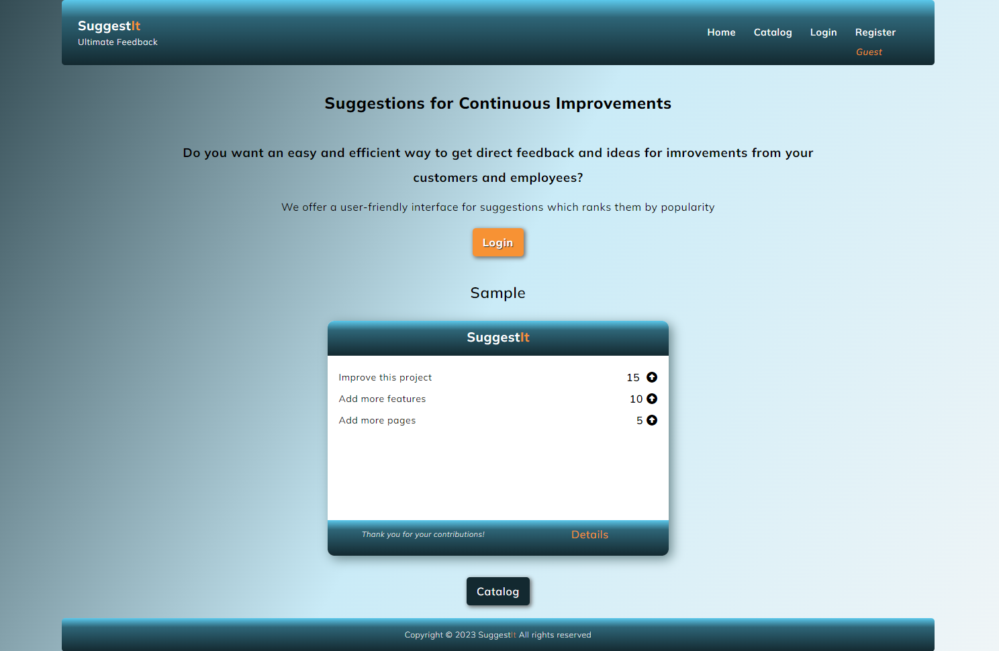

# Suggest**It**
## Project Assignment SPA with ReactJs

This is a ReactJS project assignment for completing [SoftUni](https://softuni.bg/)
ReactJS Course. Details of the assignment are available [here](https://github.com/zhenyahodges/SoftUni-Courses/blob/main/Front_End/REACT/REACT-PROJECT/ReactJS-Project-Assignment.docx).
***

## About

Suggest**It** is a web application which provides a simple interface for receiving feedback and suggestions for improvements for companies.
***

### Welcome
 

***

### Catalog

Guests & Logged Users can view the Catalog of feedbacks.
***

### Details
Guests & Logged Users can view the Details of feedback cards.

Logged users can:
* Vote for a suggestion.
* Add a new suggestion.
***

### Profile

Logged users can:
* View the feedback cards they created.
* Create new feedback cards.
* View a list of the suggestions they made.

***

